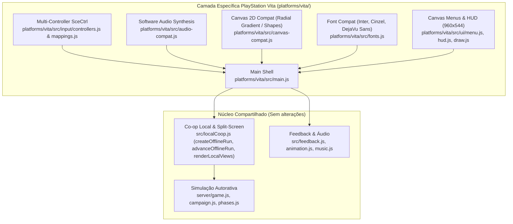

# Arcana Survivors — PlayStation Vita (homebrew `.vpk`)

Port do jogo para PlayStation Vita e PlayStation TV como pacote homebrew (`.vpk`). Roda o **mesmo** jogo da versão web e do Nintendo Switch:
solo e desafio diário, renderizado nativamente em tela cheia a **960×544** (resolução nativa das telas OLED e LCD do Vita, sem tela dividida).

| Componente | Especificação |
| --- | --- |
| Plataforma alvo | PlayStation Vita (PCH-1000 OLED, PCH-2000 LCD) & PlayStation TV (VITA TV) |
| Resolução | 960 × 544 (16:9 nativo) |
| Pacote gerado | `platforms/vita/ArcanaSurvivors.vpk` |
| Title ID | `ARCS00001` |
| LiveArea | `icon0.png` (128×128), `bg.png` (848×560), `startup.png` (280×158), `template.xml` |
| Bundle JS | `platforms/vita/build/assets/main.js` (esbuild, IIFE ES2022) |
| Toolchain nativo (opcional) | VitaSDK (`arm-vita-eabi-gcc`, `vita-mksfoex`, `vita-pack-vpk`) |

---

## 1. Gerar o `.vpk`

Requisitos: Node.js 22+ e as dependências da raiz instaladas (`npm install`).

### Instalar dependências da plataforma
```bash
npm run vita:install
```

### Gerar o pacote homebrew `.vpk`
```bash
npm run vita:vpk
```
O arquivo final é gravado em **`platforms/vita/ArcanaSurvivors.vpk`** (~4.0 MB). O build empacota:
1. `param.sfo` binário oficial do Vita (`TITLE_ID=ARCS00001`, `CATEGORY=gda`, `APP_VER=01.00`, título "Arcana Survivors");
2. LiveArea completa (`sce_sys/icon0.png`, `sce_sys/livearea/contents/bg.png`, `startup.png`, `template.xml`);
3. Fontes TTF convertidas (`Inter`, `Cinzel`, `DejaVu Sans`);
4. Atlas de sprites e efeitos em `assets/*.webp`;
5. Bundle compilado `assets/main.js` com compatibilidade de Canvas 2D e áudio PCM sintetizado.

### Build com depuração de controles e performance
```bash
npm run vita:vpk:debug
```
Gera o pacote com a flag `DEBUG_CONTROLLERS` ativada, incluindo painel de diagnóstico em tempo real dos botões do SceCtrl, analógicos e estatísticas de FPS/heap.

### Testes automatizados e verificação de tipos
```bash
npm run vita:check
```
Executa verificação de tipos (`tsc -p jsconfig.json`), teste unitário da camada de áudio (`test/audio-compat.mjs`) e teste de fumaça headless completo (`test/smoke.mjs`), simulando ciclo de vida, navegação de menus, partida solo em tela cheia (960×544), troca de poderes, desconexão/reconexão de controles no PS Vita e PSTV.

---

## 2. Instalar e Jogar

### No PlayStation Vita / PlayStation TV real
1. Transfira `ArcanaSurvivors.vpk` para o console via **VitaShell** (por cabo USB ou FTP, para qualquer partição como `ux0:data/` ou raiz de `ux0:`);
2. No VitaShell, navegue até o arquivo `.vpk`, pressione **✕** para instalar e confirme as permissões estendidas;
3. O ícone de **Arcana Survivors** aparecerá na LiveArea do console;
4. Toque no ícone e pressione **Iniciar** no portal da LiveArea para abrir o jogo.

### No Emulador Vita3K (PC)
1. Baixe e abra o [Vita3K](https://vita3k.org/);
2. Arraste e solte o arquivo `ArcanaSurvivors.vpk` diretamente na janela do emulador (ou use o menu `File` › `Install .pkg / .vpk`);
3. Inicie o jogo na grade de aplicativos do Vita3K.

---

## 3. Controles

O mapeamento de controles utiliza as máscaras oficiais da API `SceCtrl` do VitaSDK (`<psp2/ctrl.h>`), com normalização analógica com zona morta radial:

| Ação | Web | PS Vita Portátil | PSTV / DualShock 3 / DualShock 4 |
| --- | --- | --- | --- |
| Mover | WASD / Setas | Analógico Esquerdo ou D-Pad | Analógico Esquerdo ou D-Pad |
| Especial | Espaço / Enter | **✕** ou **R1** | **✕** ou **R1** |
| Esquiva | Shift | **◯** ou **L1** | **◯** ou **L1** |
| Pausar | Esc | **START** | **START** / **Options** |
| Confirmar (menus) | Clique / 1-2-3 | **✕** | **✕** |
| Voltar / Cancelar | — | **◯** | **◯** |
| Trocar opções de poder | R | **▢** | **▢** |
| Painel de Debug (em builds debug) | — | **SELECT + L1** | **SELECT + L1** / **Share + L1** |

### Modo Solo e Controles Externos (PSTV)
- **Tela Cheia Exclusiva:** O port de PS Vita não possui tela dividida; a experiência é dedicada em tela cheia a 960×544 para máxima nitidez e fluidez a 60 FPS.
- **No PlayStation TV:** Suporta controles DualShock 3 ou DualShock 4 emparelhados via Bluetooth. O controle ativo comanda a partida solo com resposta imediata.
- **Desconexão de Controle:** Se a bateria de um controle acabar ou o sinal cair durante a partida, o jogo pausa imediatamente exibindo um aviso claro. Ao reconectar o controle (ou pressionar ✕ em outro controle livre), a partida é retomada preservando rigorosamente toda a vida, XP, itens, moedas e estado do personagem.

---

## 4. Arquitetura do Port

Seguindo o design do projeto, **a simulação (`server/*.js`) e o co-op local em tela dividida (`src/localCoop.js`) não foram reescritos**. O port compartilha o mesmo núcleo da versão Web e Switch:



### Componentes de Compatibilidade:
1. **`platforms/vita/src/platform.js`**: Substitui o `src/platform.js` da web durante o empacotamento com esbuild. Retorna `app0:/assets/` como caminho base para texturas e implementa `createOffscreenCanvas` compatível com o runtime.
2. **`platforms/vita/src/input/mappings.js`**: Centraliza todas as constantes da `psp2/ctrl.h` (`SceCtrlButton.CROSS`, `SceCtrlButton.START`, etc.) e normalização de eixos 0..255 (centro 128) para o intervalo `-1.0..1.0` com zona morta radial de 0.18.
3. **`platforms/vita/src/input/controllers.js`**: Rastreia portas de controle (0 a 5), vincula portas a slots de jogadores, detecta desconexão/reconexão e emite eventos de navegação.
4. **`platforms/vita/src/audio-compat.js`**: O sintetizador procedural de áudio do jogo renderiza ondas senoidais, quadradas, dente-de-serra e ruído branco em buffers PCM de software com cache inteligente e desconexão de nós para evitar vazamentos de memória.
5. **`platforms/vita/src/canvas-compat.js`**: Fornece fallbacks para `roundRect`, `ellipse`, `setLineDash`, e converte `createRadialGradient` em recorte circular acelerado (`clip()` + `fillRect()`) para os efeitos de iluminação e auras.
6. **`platforms/vita/src/fonts.js`**: Mapeia as fontes TrueType (`Inter`, `Cinzel`, `DejaVu Sans`), resolve tamanhos/pesos e substitui glifos rúnicos não disponíveis em fontes padrão (`᛭` → `✱`, `ᛉ` → `Ψ`, `⛨` → `✠`).

---

## 5. Runtime Nativo C (VitaSDK)

Para compilar ou estender o runner nativo em C com o VitaSDK, consulte o diretório `platforms/vita/runtime/`:
- `src/main.c`: Ponto de entrada nativo com clocks de performance **444 MHz CPU / 222 MHz BUS / 222 MHz GPU / 166 MHz XBAR**, bridge QuickJS→vita2d otimizada para círculos/linhas/retângulos, amostragem analógica e laço sincronizado ao display.
- `Makefile`: Build padrão via `arm-vita-eabi-gcc` com flags `-O3 -fno-short-enums` e linking com stubs oficiais (`vita2d`, `SceCtrl_stub`, `SceGxm_stub`, etc.).
- `CMakeLists.txt`: Configuração alternativa para toolchains CMake modernos do VitaSDK.

---

## 5.1. Performance do runtime

Este código inclui uma otimização específica do renderer Vita. Primitivas simples não são mais trianguladas no JavaScript quando podem ser enviadas diretamente ao vita2d; buffers e paths temporários também são reutilizados. Veja `../../PERFORMANCE-PORTS.md` para a lista completa.

**Importante:** mudanças em `runtime/src/main.c` tornam o `eboot.bin` existente obsoleto. Antes do VPK final, execute:

```bash
npm run vita:runtime
npm run vita:vpk
```

O `build.mjs` compara o hash do source com `runtime/runtime.json` e aborta se o runtime nativo não tiver sido recompilado.

---

## 6. Lista de Verificação em Hardware (Hardware Validation Required)

Embora o port tenha sido verificado com suite de testes automatizados e no emulador Vita3K, os itens a seguir devem ser validados em hardware físico real:

- [ ] **HARDWARE VALIDATION REQUIRED — Calibração do Analógico e Deadzone**
  - Arquivo: `platforms/vita/src/input/mappings.js` (`normalizeAnalogAxes`, `STICK_DEADZONE`).
  - Teste: No menu **Controles** da build debug, verifique se sticks analógicos com leve desgaste ("drift") permanecem em repouso com `(0.00, 0.00)` e respondem prontamente ao movimento total.
- [ ] **HARDWARE VALIDATION REQUIRED — Suporte a Controles Externos no PSTV**
  - Arquivo: `platforms/vita/src/input/controllers.js` e `platforms/vita/runtime/src/main.c`.
  - Teste: Em um PlayStation TV com DualShock 4 emparelhado, confirme se as portas Bluetooth assumem o controle solo e respondem adequadamente à desconexão e reconexão.
- [ ] **HARDWARE VALIDATION REQUIRED — Overclock e Estabilidade de FPS**
  - Arquivo: `platforms/vita/runtime/src/main.c` (CPU 444 / BUS 222 / GPU 222 / XBAR 166 MHz).
  - Teste: Verifique a taxa de quadros (60 FPS estável) durante hordas intensas da Fase 5 com múltiplos projéteis na tela.
- [ ] **HARDWARE VALIDATION REQUIRED — Display OLED vs LCD**
  - Arquivo: `platforms/vita/src/ui/draw.js` (`COLORS`).
  - Teste: Confirme a legibilidade e contraste das cores de contraste alto (dourado `#f0c24b`, menta `#83d9bf`, vermelho `#e05353`) tanto no display OLED do modelo PCH-1000 quanto no painel IPS/LCD do modelo PCH-2000.
